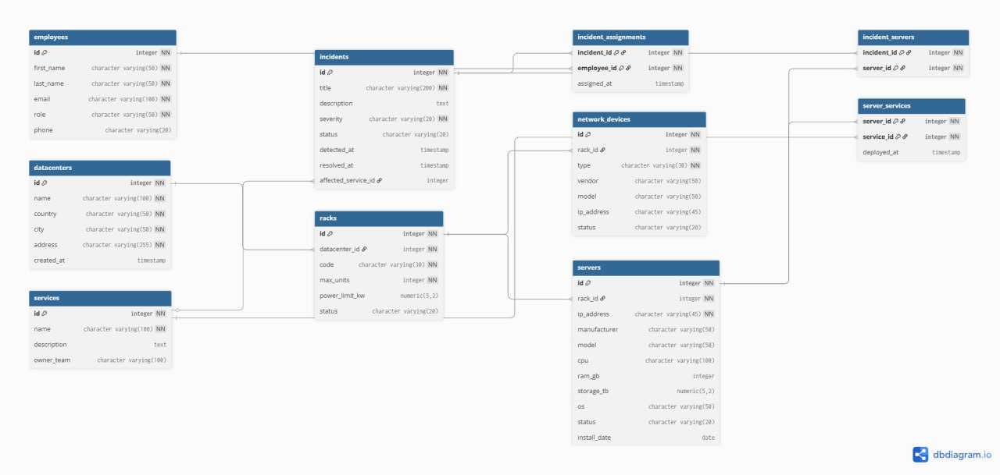

# Проект: Система учета абонентов и интернет-трафика

## 1. Тема и предметная область

**Тема проекта:** Автоматизация учета абонентов и их интернет-трафика в мобильном операторе.

**Основные сущности:**

* **Абоненты:** информация о клиентах и тарифах
* **Тарифы:** описание пакетов услуг, стоимости и лимитов
* **Сессии интернет-трафика:** регистрация активности абонентов
* **Платежи:** история оплат
* **Устройства:** устройства, используемые абонентами

**Автоматизированные процессы:** регистрация новых абонентов, контроль баланса и лимитов, формирование отчетов по трафику и платежам.

---

## 2. Структура базы данных

**Файлы проекта:**

* `schema.sql` — создание таблиц и ограничений
* `init.sql` — тестовые данные для демонстрации

**Ключевые таблицы:**

Вот описание таблиц в формате Markdown:

| Таблица | Описание | PK | FK |
| --- | --- | --- | --- |
| **datacenters** | Список дата-центров | id | - |
| **racks** | Стойки в дата-центрах | id | datacenter_id |
| **servers** | Вычислительное оборудование | id | rack_id |
| **network_devices** | Сетевое оборудование | id | rack_id |
| **services** | Программные сервисы | id | - |
| **server_services** | Связь серверов и сервисов | server_id, service_id | server_id, service_id |
| **employees** | Персонал дата-центра | id | - |
| **incidents** | Зарегистрированные инциденты | id | affected_service_id |
| **incident_servers** | Серверы, затронутые инцидентом | incident_id, server_id | incident_id, server_id |
| **incident_assignments** | Назначение сотрудников на инцидент | incident_id, employee_id | incident_id, employee_id |

**Ограничения и индексы:**

* NOT NULL и UNIQUE для критичных полей (телефон, логин, IMEI)
* CHECK для контроля бизнес-логики
* Индексы на `subscriber_id` и `session_date` для ускорения выборок

### ER-диаграмма



---


## 3. SQL-запросы

**Файл:** `queries.sql` — 10 аналитических запросов

**Типы запросов:**

* 3 простые SELECT
* 2 с фильтрацией (WHERE)
* 2 с JOIN
* 2 с агрегацией (GROUP BY, COUNT, SUM, AVG)
* 1 с HAVING/CTE или ORDER BY с LIMIT

---

## 4. Контейнеризация и автоматизация

**Вариант A (Docker):**

* `docker-compose.yml` разворачивает PostgreSQL
* Автоинициализация схемы и данных при старте
* Запуск:

```bash
docker compose up -d
```

## 5. Проверка проекта

1. Запустить контейнер PostgreSQL
2. Подключиться к базе данных
3. Проверить таблицы и связи
4. Выполнить запросы из `queries.sql`

---

## ⬇ Скачивание проекта

Скачайте все файлы проекта и выполните команду для запуска Docker:

```bash
git clone https://github.com/KBACokk/Db_local
docker compose up -d
```